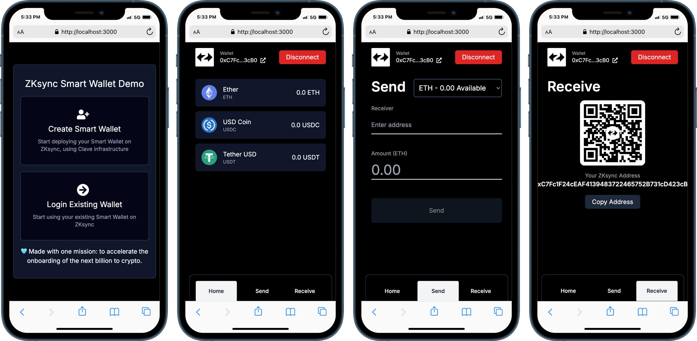

# ZKsync Smart Wallet Demo

This is a simple web application that implements client-side interactions with [Clave](https://getclave.io) Smart Contracts. You can deploy your own Clave Contracts and start using this template to interact with them. The setup guide is also published at [this blog](https://mirror.xyz/asgarovf.eth/s_Tftx4GV4ExkIZ22ENivFOJlgp7hAqjfS4t7enE8zg).



## Setting Up Client Repository

### Requirements

-   Node.js 18.18 or later. You can check your node version by running node --version
-   macOS, Windows (including WSL), and Linux are supported.

### Installing Packages

After you clone the repository, you need to install the dependencies by running the install command with your package manager. I will again use npm

```bash
npm install
```

If you are curious about which packages we use for client application, here is the list:

-   @passwordless-id/webauthn - Working with Passkeys (Webauthn)
-   ethers - Simplifying contract interactions and cryptographic operations like hashing. We are using ethers version 5, since it is used by more people based on npm data.
-   @tanstack/react-query - Handling RPC calls
-   react-icons - Easily displaying SVG icons
-   recoil - State management for React
-   zksync-ethers - Pretty much similar with ethers, but also contains some ZKsync Native AA interface features
-   cbor - Encode and parse data in the Concise Binary Object Representation (CBOR) data format (RFC8949).
-   react-qrcode-logo - Displaying Address QR Code

### Setting Deployer Wallet

Since the Clave smart accounts need to be deployed during the registration, we need to setup the deployer private key on NextJS side too. NextJS provides a way sending API requests with its own router and we can safely put the deployer private key to our client `.env` file.

**Important: Please use the private key that you used to deploy your smart contracts**

Firstly, create an .env file on the client repository and use the following format:

```
DEPLOYER_PRIVATE_KEY=****** // Replace stars with your actual private key
```

### Using Your Deployed Contracts

-   Go to `src/utils/contract.ts`
-   Replace the contracts variable with your addresses

### Running Development Server

You can start the client development server by running the command below. It will start the development server on `https://localhost:3000`

```bash
npm run dev
```

## Sending Transactions

In this section, I will explain the logic of sending transaction. The only thing you should now about preparing transactions is that you should use Core util, located at `src/utils/core.ts`. The singleton class instance is exported, so that you can use the same core object everywhere.

-   To prepare the transaction you need to use the `getTransaction` method

-   To sign and send the transaction you need to call `signAndSend` method from output of `getTransaction`

Here is the example of getting a transaction instance, also sending it to network:

```ts
import { core } from '@/utils';

// Prepare transaction
const tx = await core.getTransaction({
    to: '0xc1ECfC78959484df5472b20Cb7D43dC8c57C767A',
    value: ethers.utils.parseEther('0.001'),
});

// Send transaction to ZKsync network
await tx.signAndSend();
```

The code above gets a transaction for sending 0.001 ETH to address `0xc1ECfC78959484df5472b20Cb7D43dC8c57C767A`.

If you want to call a smart contract method, you need one additional step of preparing calldata of your transaction. This is possible with the following code block.

```ts
import { abiErc20, core } from '@/utils';

const USDC_ADDRESS = '0x235171e45abff2a15d117e3179df4cc35ebfae2f';
const USDC_DECIMALS = 6;
const RECEIVER = '0xc1ECfC78959484df5472b20Cb7D43dC8c57C767A';
const AMOUNT = '1';

// Prepare calldata
const calldata = core.getCalldata({
    abi: ERC20_ABI,
    method: 'transfer',
    args: [RECEIVER, ethers.utils.parseUnits(AMOUNT, USDC_DECIMALS)],
});

// Prepare transaction
const tx = await core.getTransaction({
    to: selectedToken.address,
    data: calldata,
});

// Send transaction to ZKsync network
await tx.signAndSend();
```

The code block above calls the transfer function from `USDC` contract to send `1 USDC` to `RECEIVER` address.

## Sending Batch Transactions

There are some cases where you may want to send multiple transactions within the same transaction - batch transactions. Batch transactions are only possible with smart contract wallets, and currently, they are the main thing that makes Clave a perfect account abstraction wallet. The following core block allows you batching multiple transactions into a single one:

```ts
const RECEIVER_1 = '0xc1ECfC78959484df5472b20Cb7D43dC8c57C767A';
const RECEIVER_2 = '0x94E9b636d0f3BDc08019B450F7f2F4Ef5b4eb2Ca';

const AMOUNT = '0.001';

// Prepare transaction
const tx = await core.getBatchTransaction(
    {
        to: RECEIVER_1,
        value: ethers.utils.parseEther(AMOUNT),
    },
    {
        to: RECEIVER_2,
        value: ethers.utils.parseEther(AMOUNT),
    },
);

// Send transaction to ZKsync network
await tx.signAndSend();
```

The code above gets a batch transaction for sending `0.001 ETH` to `RECEIVER_1` and `RECEIVER_2` addresses. You only sign once and send multiple transactions at the same time. By also setting `data` parameter of your transaction, you can call multiple methods from multiple smart contracts to make the user experience of your wallet better and better.
